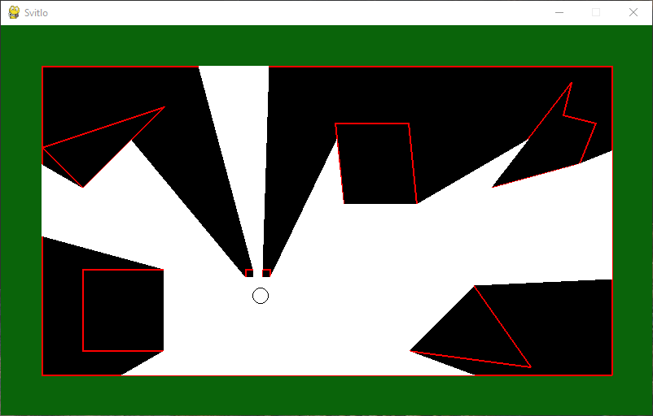

# raycasting2D
2D raycasting demo

This is raycasting 2D demo.
Light area is calculated by finding intersections between obstacles and "light rays".
Rays connect a obstacle vertex and the light source.
The number of emmited rays is equal to the number of vertices.

Move the mouse around to move the light source.

> [!TIP]
> Close the terminal window to exit the program.
